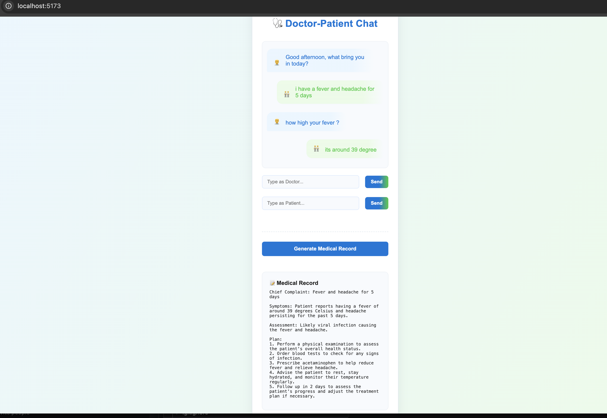
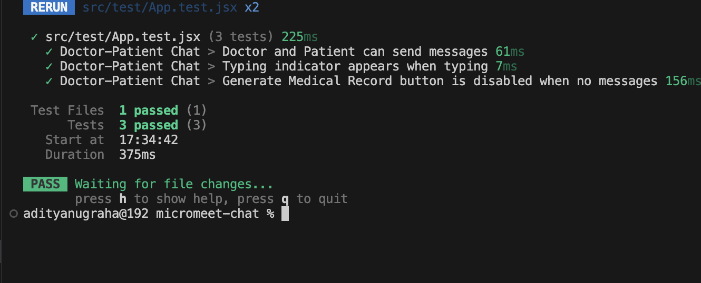

# Micromeet AI Doctor-Patient Chat & Medical Record Generator

🔗 **Live Demo**: [https://micromeet-chat-ai.vercel.app/](https://micromeet-chat-ai.vercel.app/)

## Features

- Doctor/Patient chat interface with real-time conversation
- AI-powered medical record generation using OpenAI GPT-3.5
- Secure API key management with backend proxy


## Tech Stack

- **Frontend**: React (Vite)
- **Backend**: Express.js (local) / Vercel Functions (production)
- **LLM API**: OpenAI (gpt-3.5-turbo)

## Quick Start

1. **Install dependencies:**  
   ```bash
   npm install
   ```

2. **Add OpenAI API key to `.env`:**  
   ```
   VITE_OPENAI_API_KEY=sk-your-openai-api-key
   ```

3. **Run the application:**  
   ```bash
   npm run dev:full
   ```

4. **Open browser:** Visit [http://localhost:5173](http://localhost:5173)

## Available Scripts

- `npm run dev:full` - Start both frontend and backend
- `npm run dev` - Frontend only
- `npm run server` - Backend only  
- `npm run build` - Build for production
- `npm run test` - Run unit tests

## Deploy to Vercel

1. Push code to GitHub
2. Import project at [vercel.com](https://vercel.com)
3. Add environment variable: `VITE_OPENAI_API_KEY`
4. Deploy!

## Usage

1. Enter messages as Doctor or Patient
2. Build up the conversation
3. Click "Generate Medical Record" for AI summary
4. Get structured medical record with Chief Complaint, Symptoms, Assessment, and Plan

## Architecture

**Local Development:** React frontend (5173) + Express backend (3001)  
**Production:** Static frontend + Vercel serverless function at `/api/chat`

The app automatically detects environment and uses appropriate endpoints.

## Screenshots


*Doctor-Patient chat interface with real-time conversation and medical record generation*


*Complete unit test suite with 100% pass rate using Vitest and React Testing Library*
